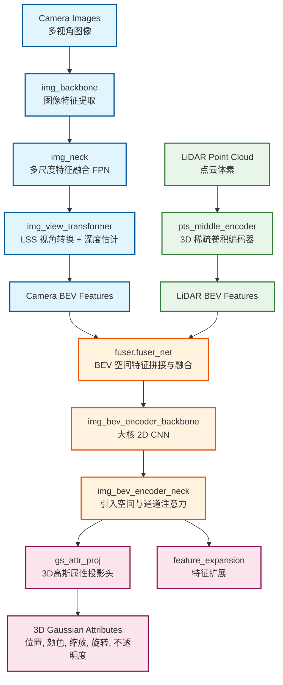
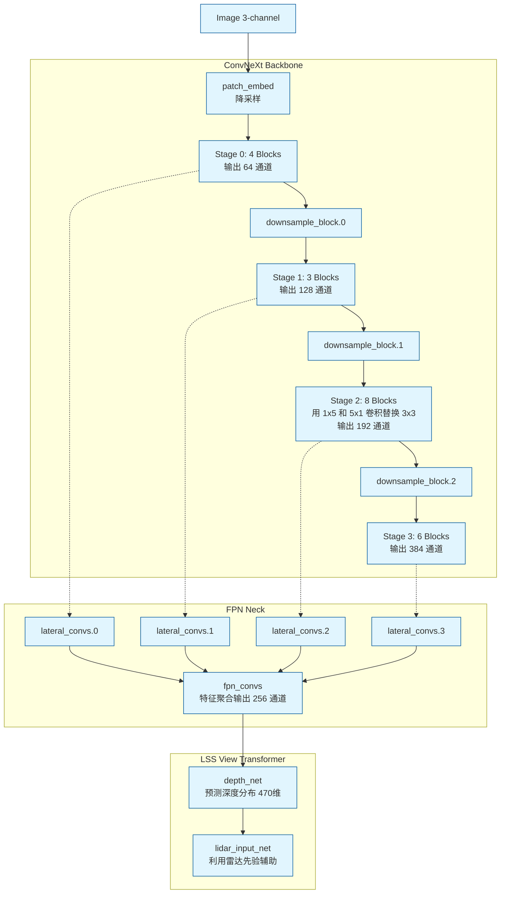
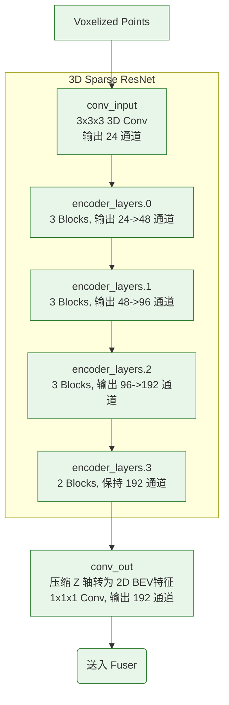
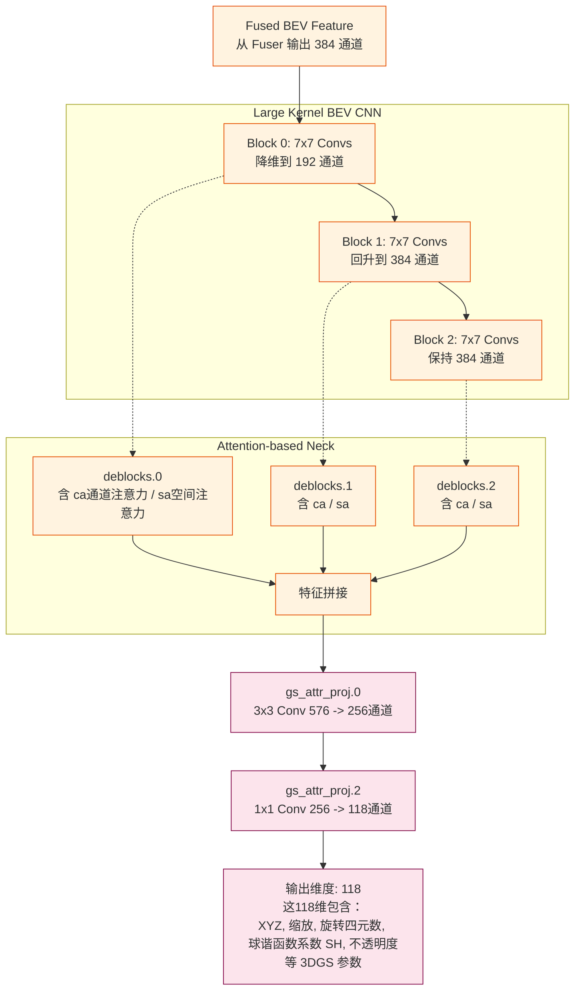

# BEVFusion: Multi-task Multi-Sensor Fusion with Unified Bird’s-Eye View Representation

## Abstract

多传感器融合对于准确且可靠的自动驾驶系统至关重要。近期的方法基于点级融合：通过相机特征增强LiDAR点云。然而，从相机到LiDAR的投影会丢失相机特征的语义密度，从而限制了这些方法的有效性，尤其是在面向语义的任务中（例如3D场景分割）。在本文中，我们提出了BEVFusion——一种高效且通用的多任务多传感器融合框架，打破了这一根深蒂固的惯例。该方法在共享的鸟瞰图（BEV）表示空间中统一多模态特征，有效保留了几何和语义信息。为实现这一点，我们通过优化的BEV池化对视图变换中的关键效率瓶颈进行诊断与改进，将延迟降低了40倍以上。BEVFusion本质上是任务无关的，几乎无需改变网络结构即可无缝支持不同的3D感知任务。它在nuScenes数据集上取得了新的最先进性能，在3D目标检测任务中mAP和NDS分别提高了1.3%，在BEV地图分割任务中mIoU提升了13.6%，同时计算成本降低了1.9倍。用于复现结果的代码已发布于 <https://github.com/mit-han-lab/bevfusion。>

## 1.Introduction

自动驾驶系统配备了多种多样的传感器。例如，Waymo 的自动驾驶汽车拥有 29 个摄像头、6 个雷达和 5 个 LiDAR。不同传感器提供互补的信号：例如，摄像头捕获丰富的语义信息，LiDAR 提供精确的空间信息，而雷达则提供瞬时速度估计。因此，多传感器融合对于准确可靠的感知至关重要。

来自不同传感器的数据本质上以不同的模态表示：例如，摄像头以透视视图捕获数据，而 LiDAR 则以 3D 视图表示数据。为了解决这种视角差异，我们必须找到一种适用于多任务多模态特征融合的统一表示。由于 2D 感知取得了巨大成功，一种自然的想法是将 LiDAR 点云投影到图像平面上，并使用 2D CNN 处理 RGB-D 数据。然而，这种 LiDAR 到摄像头的投影会引入严重的几何畸变（见图1a），使其在面向几何的任务（如 3D 目标识别）中效果较差。

近期的传感器融合方法遵循另一种方向。它们使用语义标签 [1]、CNN 特征 [2], [3] 或来自二维图像的虚拟点 [4] 来增强 LiDAR 点云，然后应用现有的基于 LiDAR 的检测器来预测3D边界框。尽管这些点级融合方法在大规模检测基准上表现出色，但在面向语义的任务（如BEV地图分割 [5], [6], [7], [8]）上却几乎无效。这是因为相机到LiDAR的投影在语义上是有损的（见图1b）：对于典型的32线LiDAR扫描仪，仅有5%的相机特征能够匹配到LiDAR点，其余全部被丢弃。对于更稀疏的LiDAR（或雷达）设备，这种密度差异将更加显著。

这篇论文中，我们提出了 BEVFusion，在共享的鸟瞰图（BEV）表示空间中统一多模态特征，实现任务无关的学习。我们同时保留了几何结构和语义密度，并自然的支持大多数 3D 感知任务，因为这些任务的输出空间可以在 BEV 中自然的表达。在将所有特征转换为 BEV 的过程中，我们识别出视图变换中的主要效率瓶颈：即 BEV 池化操作这一项就占据了模型推理运行时间的 80%以上，为此，我们提出了一种具有预计算和区间缩减的专用内核来消除该瓶颈，实现了超过 40 倍的加速。最后，我们采用全卷积 BEV 编码器来融合统一的 BEV 特征，并添加少量特定任务的 head 来支持不同的目标任务。

BEVFusion 在 nuScenes 和 Waymo 基准测试上均达到了新的3D目标检测性能纪录。无论是使用还是不使用测试时增强和模型集成，其性能均优于所有已发表的方法。BEVFusion 在鸟瞰图（BEV）地图分割任务上表现出更显著的提升，相较于纯视觉模型 mIoU 提高了 6%，相较于纯LiDAR模型 mIoU 提高了 13.6%，而现有的融合方法在该任务上几乎难以奏效。此外，BEVFusion效率极高，在计算成本降低 1.9× 的情况下实现了上述所有结果。

虽然在过去三年中，点级融合一直是首选方案，但BEVFusion通过重新思考“LiDAR空间是否真的是进行传感器融合的合适位置？”为多传感器融合领域提供了全新的视角。它展示了此前被忽视的一种替代范式的优越性能。简洁性也是其关键优势。我们希望这项工作能为未来的传感器融合研究提供一个简单而强大的基线，并激励研究者重新思考通用多任务多传感器融合的设计与范式。

## 2.Related Wrok

基于LiDAR的3D感知。研究人员设计了单阶段3D目标检测器[9]，[10]，[11]，[12]，[13]，[14]，通过PointNets[15]或SparseConvNet[16]提取展平的点云特征，并在BEV空间中进行检测。随后，[17]，[18]，[19]，[20]，[21]，[22]，[23]探索了无锚框的单阶段3D目标检测。另一类研究[24]，[25]，[26]，[27]，[28]，[29]则聚焦于两阶段目标检测器设计，在现有的一阶段检测器基础上增加RCNN网络。

基于相机的3D感知。由于LiDAR传感器的高成本，研究人员在仅使用相机的3D感知方面投入了大量努力。FCOS3D [30] 在图像检测器 [31] 的基础上增加了额外的3D回归分支，后续工作 [32], [33] 在深度建模方面对其进行了改进。不同于在透视视图中进行目标检测，[34], [35] 设计了一种基于DETR [36], [37] 的检测头，在3D空间中引入可学习的对象查询。受LiDAR-based检测器设计的启发，另一类仅使用相机的3D感知模型利用视图变换器（view transformer）[5], [38], [39], [6] 显式地将相机特征从透视视图转换到鸟瞰视图（bird’s-eye view）。BEVDet [40] 和 M2BEV [41] 将LSS [6] 和 OFT [38] 扩展至3D目标检测任务，CaDDN [42] 则在视图变换器中加入了显式的深度估计监督。最近的研究 [43], [8] 也探索了使用多头注意力机制进行视图变换。

多传感器融合。近年来，多传感器融合在3D检测领域引起了广泛关注。现有方法可分为提案级（proposal-level）和点级（point-level）融合方法。早期方法MV3D [44] 在3D空间中生成目标提案，并将其投影到图像上以提取RoI特征；[45], [46], [47] 均将图像提案提升为3D截锥体（frustum）。近期工作FUTR3D [48] 和 TransFusion [49] 在3D空间中定义对象查询，并将图像特征融合到这些查询中。**所有提案级融合方法均以对象为中心，难以直接推广到其他任务（如BEV地图分割）**。而点级融合方法通常将图像语义特征“绘制”到前景LiDAR点上，并在装饰后的点云输入上执行基于LiDAR的检测。因此，这类方法既以对象为中心又以几何为中心。其中，[1], [2], [4], [50], [51] 属于（LiDAR）输入级装饰，而DCF [52] 和 DeepFusion [3] 属于特征级装饰。

与所有现有方法不同，BEVFusion在共享的BEV空间中进行传感器融合，平等对待前景与背景、几何与语义信息，是一种通用的多任务多传感器感知框架。

## 3.Method

BEVFusion，如图2所示，专注于多传感器融合（即多视角相机和LiDAR）以实现多任务3D感知（即检测与分割）。给定不同的传感器输入后，我们首先应用模态特定的编码器来提取其特征。我们将多模态特征转换到统一的鸟瞰图（BEV）表示空间中，以同时保留几何和语义信息。我们识别出视图变换中的效率瓶颈，并通过预计算和区间缩减加速BEV池化过程。随后，我们在统一的BEV特征上应用基于卷积的BEV编码器，以缓解不同特征之间的局部不对齐问题。最后，我们附加若干任务特定的头部网络以支持不同的3D任务。

### A.Unified Representation

不同的特征可能存在于不同的视图中。例如，相机特征位于透视视图中，而激光雷达/雷达特征通常位于3D/鸟瞰视图中。即使对于相机特征，每一个特征也具有不同的视角（例如前、后、左、右）。这种视图差异使得特征融合变得困难，因为不同特征张量中的相同元素可能对应于非常不同的空间位置（因此在这种情况下，简单的逐元素特征融合将不起作用）。因此，至关重要的是找到一种共享表示，使得（1）所有传感器特征均可无信息损失地轻松转换至该表示，且（2）该表示适用于不同类型的任务。

如果是统一转换到相机图像表示上：**一种方法是可以尝试将 LiDAR 点投影到图像平面上，得到一些稀疏深度，但是这种转换会丢失几何信息，在深度图上相邻的两个点在 3D 空间可能相距甚远。**这使得相机图像表示方法在关注物体/场景的几何结构中的任务（如 3D 目标检测）中效果较差。

如果转换到雷达表示方法：大多数先进的传感器融合的方法，是把图像像素特征加到雷达点上装饰雷达点。**然而，图像像素特征到雷达的投影过程会丢失语义信息，图像和雷达的特征密度差异极大，导致仅有 5%不到的图像特征能够匹配到 LiDAR 点（对于 32 线 LiDAR 扫描仪）**。丢失图像的稠密语义特征会严重影响以语义为导向的模型性能，比如 BEV Map Segmentation。

我们的方案是统一转换到 Bird’s-Eye View，使用 BEV 视图特征作为我们融合的统一特征表示。该视角几乎适用于所有感知任务，因为输出空间也位于 BEV 中。更重要的是，向 BEV 的转换同时保留了几何结构（来自 LiDAR 特征）和语义密度（来自相机特征）。一方面，LiDAR 到 BEV 的投影沿高度维度展平稀疏的 LiDAR 特征，因此在图片 a 中不会产生几何畸变。另一方面，相机到 BEV 的投影将每个相机特征像素反投影回 3D 空间中的一条射线（细节见下一节），从而可以在图片 c 中生成保留了相机全部语义信息的稠密 BEV 特征图。

### B. Efficient Camera-to-BEV Transformation

相机图像到 BEV 的转换并非易事，因为每个相机图像像素所关联的深度本质上是模糊的。沿用 LSS（Lift-Splat-Shoot ）的方法，我们显式地预测每个像素的离散深度分布。然后将每个特征像素沿着相机射线散射为 $D$ 个离散点，并根据对应的深度概率对相关特征进行重缩放（如图 3a 所示）。这生成了一个大小为 $N \times H \times W \times D$ 的相机特征点云，其中 $N$ 为相机数量，$(H, W)$ 为相机特征图尺寸。该三维特征点云在 $x$、$y$ 轴上以步长 $r$（例如 0.4m）进行量化。我们采用 BEV 池化操作来聚合每个 $r \times r$ BEV 网格内的所有特征，并沿 $z$ 轴展平特征。 尽管简单，BEV 池化却非常低效且缓慢，在 RTX 3090 GPU 上耗时超过 500ms（而模型其余部分仅需约 100ms）。这是因为相机特征点云非常庞大：对于典型的负载，每帧可能生成约 200 万个点，密度比 LiDAR 特征点云高出两个数量级。为消除这一效率瓶颈，我们提出通过**预计算和区间缩减**来优化 BEV 池化。

**预计算。** BEV 池化的第一步是将相机特征点云中的每个点与一个 BEV 网格相关联。与 LiDAR 点云不同，相机特征点云的坐标是固定的（只要相机内参和外参保持不变，这在正确标定后通常是成立的）。受此启发，我们预先计算每个点的 3D 坐标及其对应的 BEV 网格索引，并根据网格索引对所有点进行排序，记录每个点的排序位置。在推理过程中，只需根据预计算得到的排序位置对所有特征点重新排列即可。该缓存机制可将网格关联的延迟从 17ms 降低至 4ms。

**区间缩减。** 在网格关联后，同一 BEV 网格内的所有点在张量表示中将是连续的。接下来的 BEV 池化步骤是通过某种对称函数（例如均值、最大值和求和）聚合每个 BEV 网格内的特征。如图 3b 所示，现有实现 [6] 首先计算所有点的前缀和，然后减去索引变化边界的值。然而，前缀和操作在 GPU 上需要树形归约，并产生大量无用的中间部分和（因为我们只需要边界处的值），这两者都效率低下。为了加速特征聚合，我们实现了一个专门的 GPU 内核，直接在 BEV 网格上进行并行化：为每个网格分配一个 GPU 线程，计算其区间和并将结果写回。该内核消除了输出之间的依赖关系（因此无需多级树形归约），并避免将部分和写入 DRAM，将特征聚合的延迟从 500ms 减少到 2ms（图 3c）。

通过优化后的 BEV 池化，相机到 BEV 的转换速度提升了 40 倍：延迟从超过 500ms 降低至 12ms（仅为模型端到端运行时间的 10%），并在不同特征分辨率下具有良好扩展性（图 3d）。这是实现在共享 BEV 表示空间中统一多模态感知特征的关键使能技术。与我们同期的两项工作也发现了纯相机 3D 检测中的这一效率瓶颈。它们通过假设深度分布均匀 [41] 或截断每个 BEV 网格内的点 [40] 来近似视图变换。相比之下，我们的方法无需任何近似即可实现精确计算，同时仍具有更快的速度。

### C. Fully-Convolutional Fusion

当所有传感器特征都被转换到共享的BEV表示空间后，我们可以通过逐元素操作（如拼接）轻松地将它们融合在一起。尽管处于同一空间，由于视图变换器中的深度信息不准确，LiDAR BEV特征和相机BEV特征在空间上仍可能存在一定程度的错位。为此，我们采用基于卷积的BEV编码器（包含若干残差块）来进一步对齐这些特征。

### D. Multi-Task Heads

后的BEV特征图应用多个任务特定的预测头。我们的方法适用于大多数3D感知任务。对于3D目标检测，我们遵循[17]、[49]，使用类别特定的中心热力图头来预测所有目标的中心位置，并使用若干回归头来估计目标的尺寸、旋转角度和速度。对于地图分割，不同的地图类别可能存在重叠（例如，人行横道是可行驶区域的一个子集）。因此，我们将该问题建模为多个二元语义分割任务，每个类别对应一个。我们遵循CVT [8]，使用标准的焦点损失（focal loss）[54]来训练分割头。

## 网络结构

### 全局架构：多模态 BEV 融合与 3DGS 投影 (Macro Pipeline)

这是整个网络最顶层的数据流向。它分为图像分支、点云分支，将两者转换到 BEV（鸟瞰图）空间进行特征融合，最后预测 3D 高斯属性。

### 图像分支细节 (Image Branch: ConvNeXt-like + FPN)

从 `dwconv` (Depthwise Conv) 和 `pwconv` (Pointwise Conv) 的组合，以及 `layer_scale` 来看，图像主干网络是一个典型的 **ConvNeXt** 变体。

### 点云分支细节 (Point Cloud Branch: 3D Sparse Encoder)

从权重 `[C_out, C_in, kD, kH, kW]` 的 5D 张量可以看出，这里处理的是 3D Voxel 数据。

### 后端：BEV 编码器与 3DGS 输出头 (BEV Encoder & Head)

融合后的特征会进入一个拥有 7x7 大卷积核的 2D BEV 网络，并且在其 Neck 部分引入了注意力机制（Spatial Attention 和 Channel Attention），最终映射到高斯属性。

