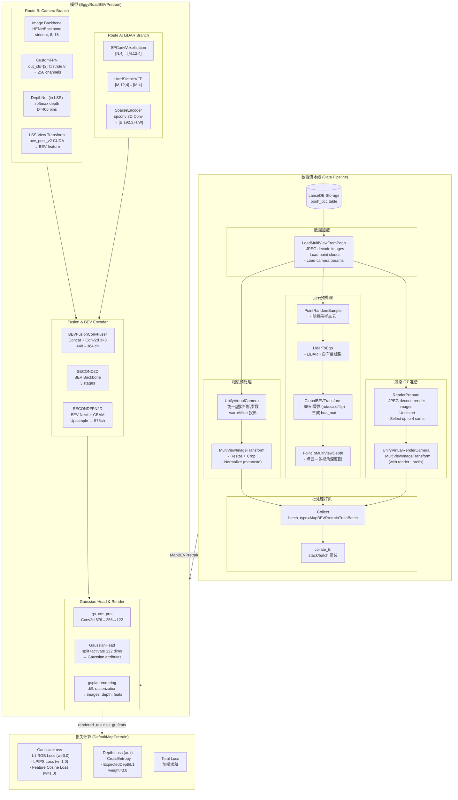
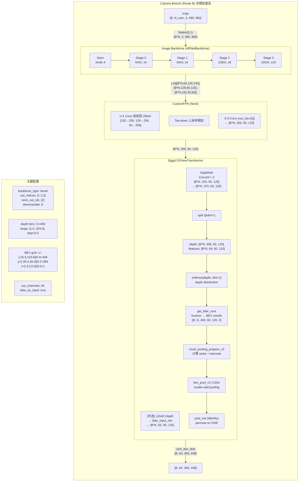
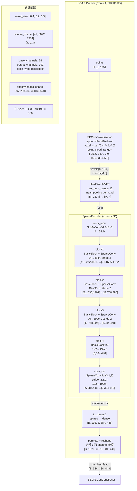
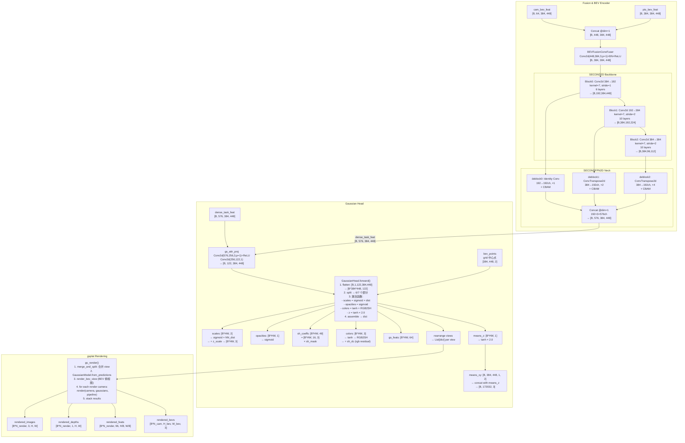
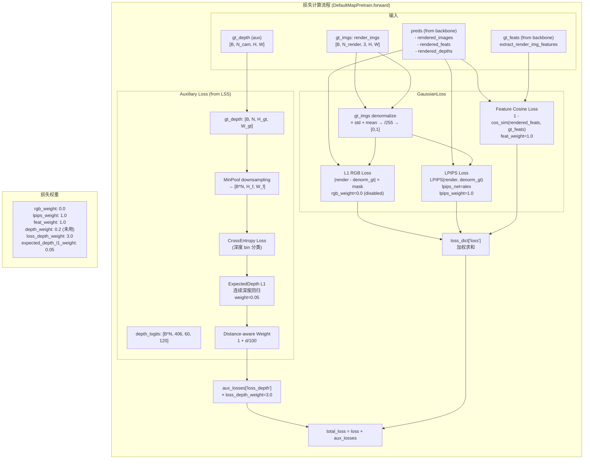
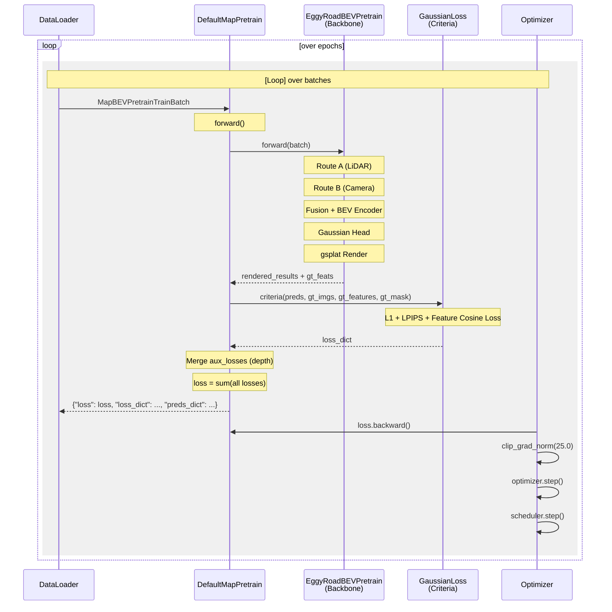

# Map Pretrain 完整训练链路 Mermaid 流程图

> 本文件包含多个 Mermaid 流程图，可在支持 Mermaid 的 Markdown 渲染器中查看（如 GitHub, VS Code 等）。

---

## 1. 整体训练链路总览

---

## 2. Camera Route B 详细流程图

---

## 3. LiDAR Route A 详细流程图

---

## 4. Fusion, BEV Encoder & Gaussian Head 流程图

---

## 5. 损失计算流程图

---

## 6. 训练循环时序图

