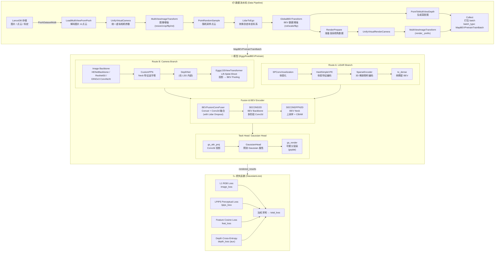
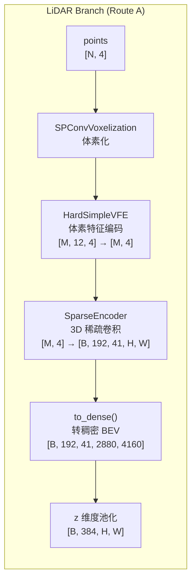
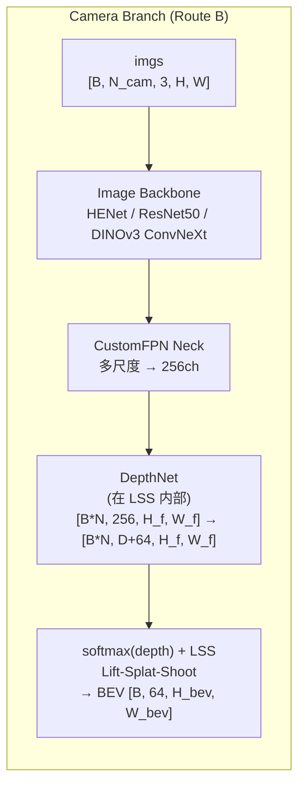
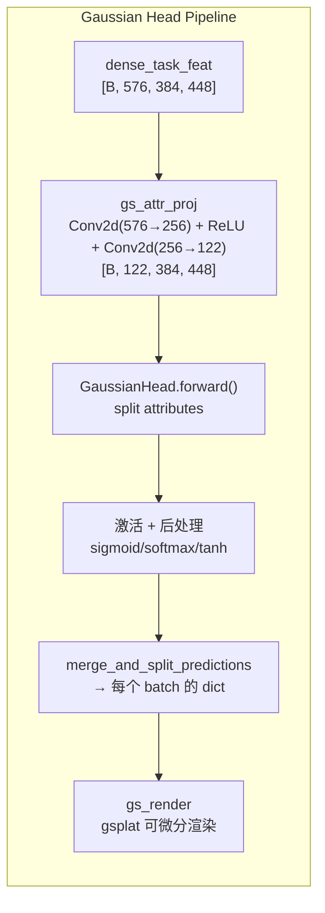
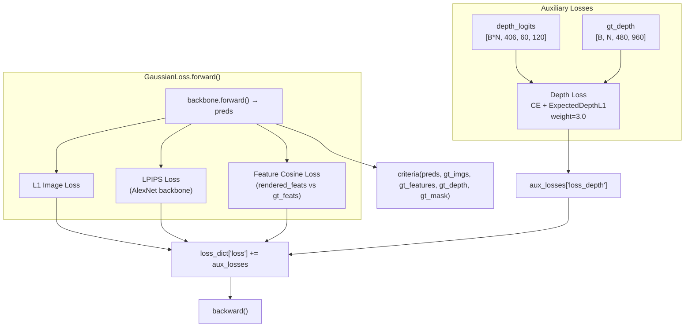
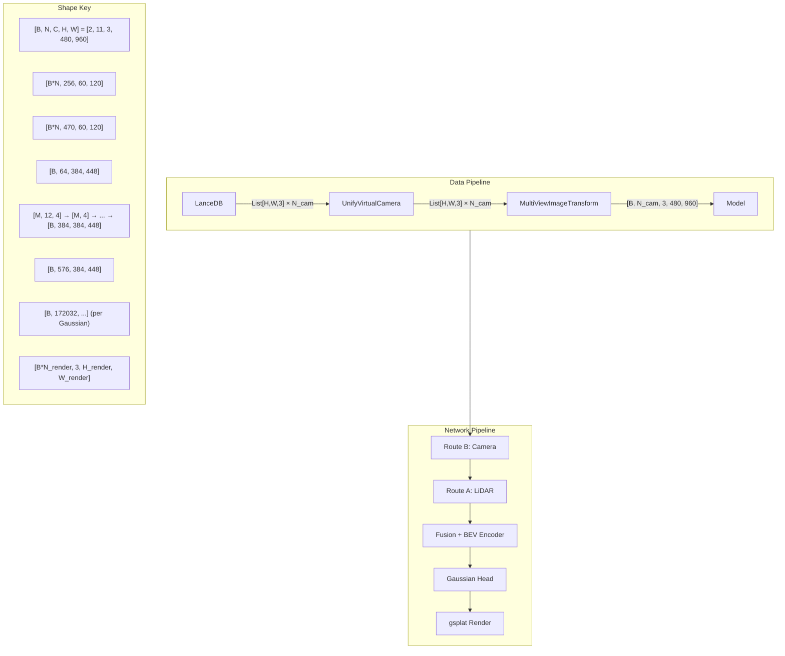

# Map Pretrain (RoadBEVPretrain) 完整训练链路文档

## 概述

本文档详细描述了基于 **EggyRoadBEVPretrain** 模型的地图预训练完整流水线。该模型采用 **BEVFusion** 架构，融合 **Camera (Route B)** 和 **LiDAR (Route A)** 双模态，通过 **LSS (Lift-Splat-Shoot)** 视角变换将多视角相机特征投影到 BEV 空间，最终使用 **3D Gaussian Splatting** 进行渲染监督训练。

---

## 目录

1. [整体架构图](#1-整体架构图)
2. [训练入口](#2-训练入口)
3. [数据流水线](#3-数据流水线)
4. [模型结构详解](#4-模型结构详解)
5. [损失函数](#5-损失函数)
6. [训练循环](#6-训练循环)
7. [配置参数汇总](#7-配置参数汇总)
8. [文件索引](#8-文件索引)

---

## 1. 整体架构图



---

## 2. 训练入口

### 入口脚本
- **文件**: [tools/train.py](/gzh/gaussian_perception/tools/train.py)
- **配置**: [configs/map_pretrain/road_bev_pretrain.yaml](/gzh/gaussian_perception/configs/map_pretrain/road_bev_pretrain.yaml)

### 启动命令
```bash
python tools/train.py --config-file configs/map_pretrain/road_bev_pretrain.yaml
```

### 模型组装流程

```
tools/train.py
  └─ explicit_build_model()
       ├─ 解析 YAML → RoadBEVPretrainConfig (dataclass)
       ├─ EggyRoadBEVPretrain(road_bev_config)    ← Backbone (含 Head)
       ├─ GaussianLoss(...)                        ← Criteria
       └─ DefaultMapPretrain(backbone, criteria)   ← 顶层封装器
```

### 关键类关系

| 类名 | 作用 | 文件 |
|------|------|------|
| `EggyRoadBEVPretrain` | 核心模型，包含所有子模块 | [road_bev_pretrain.py](/gzh/gaussian_perception/eggy/models/map_pretrain/road_bev_pretrain.py) |
| `DefaultMapPretrain` | 通用训练封装器，包装 backbone + criteria | [default.py](/gzh/gaussian_perception/eggy/models/default.py) |
| `GaussianLoss` | 基于渲染的损失函数 | [gaussian_loss.py](/gzh/gaussian_perception/eggy/models/map_pretrain/utils/gaussian_loss.py) |
| `TrainerBase` | 训练引擎 | [train.py](/gzh/gaussian_perception/eggy/engines/train.py) |

---

## 3. 数据流水线

### 3.1 数据源

- **数据库格式**: LanceDB
- **表名**: `pooh_occ`
- **数据路径**: `/J6P-perception/advc/test/wzx_online_map_pretrain_data/test_occ/LANCE_DB_0/`
- **字段**:
  - `images`: 多相机 JPEG 编码图片
  - `point_clouds`: LiDAR 点云
  - `cam_intrinsics` / `cam_distortion` / `cam2ego`: 相机标定
  - `render_images` / `render_images_mask`: 渲染视角 GT 图片和掩码
  - `render_cam_intrinsics` / `render_cam_distortion` / `render_cam2ego`: 渲染相机标定

### 3.2 相机配置

| 相机组 | 相机列表 | 虚拟焦距 | 输入尺寸 |
|--------|----------|----------|----------|
| **Fisheye** (4个) | `camera_fisheye_front/left/rear/right` | 472.5 | 480×960 |
| **Narrow** (7个) | `camera_front_narrow/rear/front_left/.../front_wide` | 3670.0 | 480×960 |

### 3.3 数据预处理变换链

#### 步骤 1: LoadMultiViewFromPooh
- **文件**: [loading.py](/gzh/gaussian_perception/eggy/datasets/transforms/loading.py)
- **操作**:
  - 从 LanceDB 读取多视角图片 (JPEG 解码) 和点云
  - 读取相机内参/畸变/外参
  - 计算 `lidar2img` 投影矩阵
- **输出**:
  - `imgs`: `List[H, W, 3]` (float32, 原始分辨率 1080×1920)
  - `points`: `[N, 4+C]` (x, y, z, intensity, ...)
  - `intrinsics`: `List[3, 3]`, `sensor2ego`: `List[4, 4]`

#### 步骤 2: UnifyVirtualCamera
- **文件**: [geometry_3d.py](/gzh/gaussian_perception/eggy/datasets/transforms/geometry_3d.py) (line 14-108)
- **操作**:
  - 根据虚拟焦距计算缩放和裁剪参数
  - `warpAffine` 将不同相机的图像统一到相同的虚拟相机参数
  - 生成 `post_rots` (旋转矩阵, `[3,3]`) 和 `post_trans` (平移向量, `[3]`)
- **输出**:
  - `imgs`: `List[1080, 1920, 3]` (统一到虚拟相机)
  - `post_rots`: `List[3, 3]`, `post_trans`: `List[3]`

#### 步骤 3: MultiViewImageTransform
- **文件**: [augmentation_3d.py](/gzh/gaussian_perception/eggy/datasets/transforms/augmentation_3d.py) (line 18)
- **操作**:
  - resize: `960` (宽) → `input_size[1]` (默认 800)
  - random crop: 裁剪到 `input_size` (= 480×960, 配置中是 480×960)
  - random flip (训练时)
  - random rotate (训练时, 默认 ±0°)
  - 归一化: `(x - mean) / std`
- **输出**:
  - `imgs`: `List[3, 480, 960]` (CHW, float32, 归一化)
  - `post_rots` / `post_trans` 更新 (包含 resize/crop/flip/rot 变换)

#### 步骤 4: PointRandomSample
- **文件**: [augmentation_3d.py](/gzh/gaussian_perception/eggy/datasets/transforms/augmentation_3d.py) (line 323)
- **操作**: 随机采样点云 (用于控制点数)
- **输出**: `points` 点数变化 (根据配置, 当前 prob=0.0, 即不采样)

#### 步骤 5: LidarToEgo
- **文件**: [geometry_3d.py](/gzh/gaussian_perception/eggy/datasets/transforms/geometry_3d.py) (line 237)
- **操作**: 将 LiDAR 点云从 LiDAR 坐标系转换到自车 (Ego) 坐标系
- **输出**: `points` 坐标变换

#### 步骤 6: GlobalBEVTransform
- **文件**: [geometry_3d.py](/gzh/gaussian_perception/eggy/datasets/transforms/geometry_3d.py)
- **操作**: BEV 空间数据增强
  - flip (dx/dy)
  - rotation (默认 ±0°)
  - scaling (默认 1.0)
  - 生成 `bda_mat`: BEV 数据增强矩阵 `[4, 4]`
- **输出**: `bda_mat` `[4, 4]`, 点云和边界框同步变换

#### 步骤 7: PointToMultiViewDepth
- **文件**: [geometry_3d.py](/gzh/gaussian_perception/eggy/datasets/transforms/geometry_3d.py) (line 115)
- **操作**:
  - 将自车坐标系下的点云投影到每个相机的图像平面
  - 生成稀疏深度图 (仅保留最近点)
- **输出**: `gt_depth` `[N_cams, H, W]` (稀疏深度图, `H=480, W=960`)

#### 步骤 8: RenderPrepare
- **文件**: [render_prepare.py](/gzh/gaussian_perception/eggy/datasets/transforms/render_prepare.py)
- **操作**:
  - 从 LanceDB 读取渲染视角的图片和掩码
  - JPEG 解码
  - 可选去畸变 (fisheye / standard)
  - 随机选择最多 4 个渲染视角
- **输出**:
  - `render_imgs`: `List[H, W, 3]` (原始分辨率)
  - `render_masks`: `List[H, W]` (uint8)
  - `render_intrinsics` / `render_sensor2ego`

#### 步骤 9: UnifyVirtualRenderCamera + MultiViewImageTransform (render_ prefix)
- 同步骤 2-3，但使用 `render_` 前缀
- 将渲染视角图像也变换到统一虚拟相机参数和相同尺寸

#### 步骤 10: Collect (打包)
- **文件**: [formatting.py](/gzh/gaussian_perception/eggy/datasets/transforms/formatting.py) (line 50-114)
- **操作**: 收集指定字段，标记 `batch_type: MapBEVPretrainTrainBatch`
- **输出**: `MapBEVPretrainTrainBatch` (见 [batch.py](/gzh/gaussian_perception/eggy/models/map_pretrain/utils/batch.py))

#### 步骤 11: collate_fn (批处理)
- **文件**: [collate.py](/gzh/gaussian_perception/eggy/dataloader/collate.py)
- **操作**: 根据 `batch_type` 分发到 `_build_map_bev_pretrain_train_batch`
- 稠密字段 stack，ragged 字段 (points) 保持 list

### 3.4 Batch 数据结构

```python
@dataclass
class MapBEVPretrainTrainBatch:
    imgs: torch.Tensor              # [B, N_cam, 3, H, W]    归一化图像
    points: List[torch.Tensor]      # list of [N_i, 4+C]      点云
    intrinsics: torch.Tensor        # [B, N_cam, 3, 3]       内参
    distorteds: torch.Tensor        # [B, N_cam, 14]         畸变系数
    sensor2ego: torch.Tensor        # [B, N_cam, 4, 4]       相机→自车
    render_imgs: torch.Tensor       # [B, N_render, 3, H, W] 渲染GT图
    render_masks: torch.Tensor      # [B, N_render, H, W]    渲染掩码
    render_intrinsics: torch.Tensor # [B, N_render, 3, 3]
    render_sensor2ego: torch.Tensor # [B, N_render, 4, 4]
    post_rots: torch.Tensor         # [B, N_cam, 3, 3]       后处理旋转
    post_trans: torch.Tensor        # [B, N_cam, 3]          后处理平移
    post_intrinsics: torch.Tensor   # [B, N_cam, 3, 3]       后处理内参
    render_post_rots/trans/intrinsics: # 同上, render 版本
    bda_mat: torch.Tensor           # [B, 4, 4]              BEV 增强矩阵
    gt_depth: torch.Tensor          # [B, N_cam, H, W]       稀疏深度 GT
```

---

## 4. 模型结构详解

### 4.1 Route A: LiDAR 支路



#### 4.1.1 SPConvVoxelization (体素化)

| 属性 | 值 |
|------|-----|
| 文件 | [encoders.py](/gzh/gaussian_perception/eggy/models/bevfusion_od/encoders.py) (line 10) |
| voxel_size | `[0.4, 0.2, 0.5]` (x, y, z) 米 |
| point_cloud_range | `[-25.6, -38.4, -3.0, 153.6, 38.4, 5.0]` 米 |
| max_num_points | 12 (每个体素最大点数) |
| max_voxels | `[120000, 220000]` (训练/测试) |
| num_point_features | 4 (x, y, z, intensity) |

- **输入**: `[N, 4]` 点云
- **输出**: `voxels=[M, 12, 4]`, `coordinates=[M, 3]`, `num_points=[M]`

#### 4.1.2 HardSimpleVFE (体素特征编码)

- **文件**: [encoders.py](/gzh/gaussian_perception/eggy/models/bevfusion_od/encoders.py) (line 55)
- **操作**: 对每个体素内所有点特征取均值
- **输入**: `[M, 12, 4]` → **输出**: `[M, 4]`

#### 4.1.3 SparseEncoder (稀疏 3D 编码器)

- **文件**: [encoders.py](/gzh/gaussian_perception/eggy/models/bevfusion_od/encoders.py) (line 146)
- **配置**:
  - `in_channels`: 4
  - `base_channels`: 24
  - `sparse_shape`: `[41, 3072, 3584]` (z, y, x)
  - `output_channels`: 192
  - `block_type`: "basicblock"
  - `encoder_channels`: `((24,24,48), (48,48,96), (96,96,192), (192,192))`

**网络结构**:

| 层级 | 操作 | 输入通道 | 输出通道 | 步长 | 稀疏形状变化 |
|------|------|---------|---------|------|-------------|
| conv_input | SubMConv3d 3×3×3 | 4 | 24 | 1 | [41,3072,3584] |
| block1 | SparseBasicBlock ×1 + SparseConv3d ×1 | 24 | 48 | 2(spatial) | [21,1536,1792] |
| block2 | SparseBasicBlock ×1 + SparseConv3d ×1 | 48 | 96 | 2(spatial) | [11,768,896] |
| block3 | SparseBasicBlock ×1 + SparseConv3d ×1 | 96 | 192 | 2(spatial) | [6,384,448] |
| block4 | SparseBasicBlock ×2 | 192 | 192 | 1 | [6,384,448] |
| conv_out | SparseConv3d (3,1,1) | 192 | 192 | (2,1,1) | [3,384,448] |

- **输入**: `voxel_features=[M, 4]`, `coors=[M, 4]` (batch, z, y, x)
- **输出**: `[B, 192, 3, 384, 448]` (经 to_dense() 后的稠密特征)

> **注意**: 配置中的 `sparse_shape=[41, 2880, 4160]` 对应旧版参数，但 YAML 配置实际使用 `[41, 3072, 3584]`。由于步长 2×2×2 下采样 4 次 → `41/16=2.56` 取整到 3，空间分辨率 3072/8=384, 3584/8=448 (经过 conv_out 的 (3,1,1) 步长后 z 再下采样 2)。

#### 4.1.4 SparseEncoder 输出后处理

在 [road_bev_pretrain.py](/gzh/gaussian_perception/eggy/models/map_pretrain/road_bev_pretrain.py) 的 `forward()` 中：

- `pts_middle_encoder` 返回 `[B, 192, 3, H, W]` (z=3, y=384, x=448)
- 通过 `SparseEncoder` 内部的 `dense()` 方法转成稠密 → `[B, 192, 3, 384, 448]`
- 后续在 `BEVFusionConvFuser` 中, 内部会将 z 维度合并 → `[B, 576, 384, 448]` (但代码实际只用了 `[B, 192, 3, H, W]` 通过 permute 转为 `[B, 576, H, W]`)

> 注: 代码中配置 `route_a.middle_output_channels=192`，但最终 pts_bev_feat 的通道应为 192 × 3(z) = 576? 实际代码中 `SparseEncoder` 的 `output_channels=192`，输出的 `[B, 192, 3, H, W]` 在 `pts_middle_encoder` 返回时会 `permute` 成 `[B, 576, H, W]` (将 z 和 channel 合并)。

### 4.2 Route B: Camera 支路



#### 4.2.1 Image Backbone

**支持的 backbone 类型**:

| 类型 | 类名 | 文件 |
|------|------|------|
| `henet` (默认) | `HENetBackbone` | [henet.py](/gzh/gaussian_perception/eggy/extractors/henet.py) |
| `dinov3_convnext_base/tiny/small/large` | `DINOv3ConvNeXtBackbone` | [dinov3_backbone.py](/gzh/gaussian_perception/eggy/extractors/dinov3_backbone.py) |
| `ResNet50` (回退) | `BackboneResNet50` | [camera_encoders.py](/gzh/gaussian_perception/eggy/models/bevfusion_od/camera_encoders.py) |

**当前配置 (HENet)**:
- **文件**: [henet.py](/gzh/gaussian_perception/eggy/extractors/henet.py)
- `embed_dims`: `[64, 128, 192, 384]`
- `backbone_out_indices`: `[1, 2, 3]`
- `backbone_frozen_stages`: 4 (整个 backbone 冻结)
- `backbone_frozen_params`: true
- **预训练权重**: `/J6P-perception/advc/test/wangzhixing_code/pretrain_henet/siamese.pth.tar`

**HENet 输出特征**:

| 阶段 (stage) | 输出通道 | 下采样倍数 (stride) | out_indices |
|-------------|---------|-------------------|-------------|
| stem | 64 | 4× | - |
| stage0 (layer0) | 64 | 4× | index 0 |
| stage1 (layer1) | 64 | 4× | index 1 |
| stage2 (layer2) | 128 | 8× | index 2 |
| stage3 (layer3) | 192 | 16× | index 3 |
| stage4 (layer4) | 384 | 32× | - |

当前配置 `out_indices=[1, 2, 3]` → 输出通道 `[64, 128, 192]` (stride 4, 8, 16)。

#### 4.2.2 CustomFPN (Neck)

- **文件**: [camera_encoders.py](/gzh/gaussian_perception/eggy/models/bevfusion_od/camera_encoders.py) (line 62)
- **配置**:
  - `in_channels`: `[64, 64, 128, 192, 384]` (HENet 5 级输出)
  - `out_channels`: 256
  - `out_ids`: `[2]` (只使用第 2 级, 即 stride=8 的特征)

**网络结构**:
- 对每级输入做 1×1 卷积投影到 256 通道
- Top-down 路径: 从高层到低层逐级上采样相加
- **输出**: `[B*N, 256, H_feat, W_feat]` (H_feat=H/8, W_feat=W/8)

输入尺寸 `480×960` → `backbone_out_indices=[1,2,3]`:
- index 1: `[B*N, 64, 120, 240]` (stride 4)
- index 2: `[B*N, 128, 60, 120]` (stride 8) ✓ out_ids=[2]
- index 3: `[B*N, 192, 30, 60]` (stride 16)

最终输出: `[B*N, 256, 60, 120]`

#### 4.2.3 EggyLSSViewTransformer

- **文件**: [lss_transformer.py](/gzh/gaussian_perception/eggy/models/components/lss_transformer.py)
- **核心配置**:

| 参数 | 值 | 说明 |
|------|-----|------|
| `downsample` | 8 | 特征图下采样倍数 |
| `in_channels` | 256 | FPN 输出通道 |
| `out_channels` | 64 | BEV 特征通道 |
| `input_size` | `[480, 960]` | 网络输入尺寸 (H, W) |
| `lidar_as_input` | true | 是否使用 LiDAR depth 作为额外输入 |
| `use_depth_loss` | true | 是否使用深度监督损失 |
| `use_expected_depth_l1` | true | 是否使用期望深度 L1 损失 |
| `use_distance_weighting` | true | 是否使用距离加权 |

**Grid 配置**:

| 轴 | 范围 | 分辨率 | 格点数 |
|----|------|--------|--------|
| depth | [1.0, 204.0] | 0.5 | D=406 个深度 bin |
| x (前后) | [-25.6, 153.6] | 0.4 | W_bev = 448 |
| y (左右) | [-38.4, 38.4] | 0.2 | H_bev = 384 |
| z (高程) | [-3.0, 5.0] | 8.0 | 1 (z 方向 1 个 grid) |

##### LSS 内部网络

**DepthNet** (当 `lidar_as_input=True`):

```
lidar_input_net:
  Conv2d(1, 8, 1) → ReLU → Conv2d(8, 32, 5, stride=4, padding=2)
  → BN → ReLU → Conv2d(32, 64, 5, stride=downsample//4, padding=2)
  → BN → ReLU

  [输入: B*N, 1, 480, 960] → [输出: B*N, 64, 60, 120]

depth_net:
  Conv2d(256+64, 256, 3, padding=1) → BN → ReLU
  → Conv2d(256, 256, 3, padding=1) → BN → ReLU
  → Conv2d(256, D + 64, 1)   # D=406, 64=out_channels

  [输入: B*N, 320, 60, 120] → [输出: B*N, 470, 60, 120]
```

##### 张量形状变化

```
输入: imgs [B, N_cam, 3, H, W]  (H=480, W=960)
  │ flatten(0,1)
  ├─→ [B*N, 3, 480, 960]
  │
  ├─ Image Backbone (HENet)
  │   └─→ [B*N, 256, 60, 120]   (经过 CustomFPN, stride=8)
  │
  ├─ (可选) LidarDepth → lidar_input_net → [B*N, 64, 60, 120]
  │   concat with feats → [B*N, 320, 60, 120]
  │
  ├─ DepthNet (float32)
  │   └─→ [B*N, D+64, 60, 120] = [B*N, 470, 60, 120]
  │
  ├─ split: depth=[B*N, 406, 60, 120], features=[B*N, 64, 60, 120]
  │   softmax(depth, dim=1) → depth distribution
  │
  ├─ view_transform_core (LSS 投影)
  │   ├─ get_lidar_coor: 计算 frustum 点云在 BEV 空间坐标
  │   │   frustum: [D, H_f, W_f, 3] = [406, 60, 120, 3]
  │   │   投影后: [B, N, 406, 60, 120, 3] (x, y, z in BEV frame)
  │   │
  │   ├─ voxel_pooling_prepare_v2: 计算 pooling 索引
  │   │
  │   └─ bev_pool_v2 (CUDA kernel): scatter-add
  │       [B, N, 406, 60, 120] depth × [B, N, 60, 120, 64] features
  │       → [B, 1, 384, 448, 64] → squeeze → [B, 384, 448, 64]
  │       → permute → [B, 64, 384, 448]
  │
  └─→ cam_bev_feat: [B, 64, 384, 448]  (H_bev=y=384, W_bev=x=448)
```

### 4.3 Fusion & BEV Encoder

#### 4.3.1 BEVFusionConvFuser

- **文件**: [bev_encoders.py](/gzh/gaussian_perception/eggy/models/bevfusion_od/bev_encoders.py) (line 9)
- **配置**: `in_channels=448`, `out_channels=384`

```
  cam_bev_feat: [B, 64, 384, 448]
+ pts_bev_feat: [B, 384, 384, 448]
  ─────────────────────────────
  concat:       [B, 448, 384, 448]
  → Conv2d(448, 384, 3, padding=1) → BN → ReLU
  → [B, 384, 384, 448]
```

**Lidar Dropout**: 训练时以 `lidar_drop_prob=0.1` 的概率将 LiDAR BEV 特征置零，防止模态坍缩。

#### 4.3.2 SECOND2D (BEV Backbone)

- **文件**: [bev_encoders.py](/gzh/gaussian_perception/eggy/models/bevfusion_od/bev_encoders.py) (line 40)
- **配置**:

| 参数 | 值 |
|------|-----|
| `in_channels` | 384 |
| `out_channels` | `[192, 384, 384]` |
| `layer_nums` | `[6, 10, 10]` |
| `layer_strides` | `[1, 2, 2]` |
| `kernel_size` | 7 |
| `padding` | 3 |

**网络结构**:

| Block | 输入通道 | 输出通道 | 步长 | 空间尺寸 |
|-------|---------|---------|------|---------|
| block0 | 384 | 192 | 1 | 384×448 |
| block1 | 192 | 384 | 2 | 192×224 |
| block2 | 384 | 384 | 2 | 96×112 |

每个 block 包含: 1 个初始卷积 + N 个后续卷积 (kernel=7, padding=3, 保持尺寸)。

- **输出**: `List[[B,192,384,448], [B,384,192,224], [B,384,96,112]]`

#### 4.3.3 SECONDFPN2D (BEV Neck)

- **文件**: [bev_encoders.py](/gzh/gaussian_perception/eggy/models/bevfusion_od/bev_encoders.py) (line 129)
- **配置**:

| 参数 | 值 |
|------|-----|
| `in_channels` | `[192, 384, 384]` |
| `out_channels` | `[192, 192, 192]` |
| `upsample_strides` | `[1, 2, 4]` |
| `use_cbam` | true |

**网络结构**:

| 输入来源 | 输入通道 | 操作 | 输出通道 | 上采样倍数 | 输出尺寸 |
|---------|---------|------|---------|-----------|---------|
| block0 | 192 | Identity Conv | 192 | 1× | 384×448 |
| block1 | 384 | ConvTranspose2d | 192 | 2× | 384×448 |
| block2 | 384 | ConvTranspose2d | 192 | 4× | 384×448 |

每个路径后接 BN + ReLU + CBAM 注意力模块。

**输出**: `[B, 576, 384, 448]` (3 个 192 通道特征在通道维拼接)

#### 4.3.4 无 LiDAR 支路时的路径

当 `use_lidar_branch=False` 时:
- 跳过 Route A 全部
- 不使用 Fusion 和 BEV Encoder
- `dense_task_feat = cam_bev_feat` → `[B, 64, 384, 448]`
- `input_feat_dim = 64` (gs_attr_proj 输入通道)

### 4.4 Task Head: Gaussian Head



#### 4.4.1 Gaussian 属性计算

在 [road_bev_pretrain.py](/gzh/gaussian_perception/eggy/models/map_pretrain/road_bev_pretrain.py) 中:

```python
# compute_gs_attr_size() 计算的参数:
d_means = 3
d_scales = 2             # 2D scale (x, y)，各向同性
d_rotations = 0          # 不预测旋转
d_opacities = 1
d_view_dep_features = 3  # RGB 3 通道
sh_degree = 3            # 球谐阶数
d_sh = (3+1)^2 = 16
d_gs_feat = 64           # 高斯特征维度
d_attr = d_scales + d_rotations + d_opacities + d_view_dep_features * d_sh + d_gs_feat
       = 2 + 0 + 1 + 3*16 + 64 = 115
d_attr_w_rgb = d_attr + d_view_dep_features + (1 if pred_gaussian_z else 0)
             = 115 + 3 + 1 = 119  (pred_gaussian_z=True)
             = 115 + 3 + 0 = 118  (pred_gaussian_z=False)
```

#### 4.4.2 gs_attr_proj

```
输入: dense_task_feat [B, 576, 384, 448]
  → Conv2d(576, 256, 3, padding=1) → ReLU
  → Conv2d(256, 122, 1)
输出: [B, 122, 384, 448]   (注意 122 ≠ 119，实际代码计算略有不同，含 rgb 维度)
```

> 注: 实际 `d_attr_w_rgb` 在代码中计算为 122 (包含 rgb 残差维度)。具体数值需追踪 `compute_gs_attr_size` 中 `pred_gaussian_z=True` 时的完整计算。

#### 4.4.3 GaussianHead

- **文件**: [gaussian_head.py](/gzh/gaussian_perception/eggy/models/map_pretrain/gaussian_head.py)

**输入**:
- `means`: `[B, 384, 448, 1, 2]` (BEV grid 中心点坐标 x, y)
- `gaussian_attr`: `[B, 1, 122, 384, 448]` (来自 gs_attr_proj)

**处理流程**:

```
1. permute + flatten: [B,1,122,384,448] → [B*384*448, 122]
2. split attributes (pred_gaussian_z=True):
   - scales: [B*HW, 2]
   - rotations: [B*HW, 0] (无)
   - opacities: [B*HW, 1]
   - sh_coeffs: [B*HW, 48] = 16*3
   - gs_feats: [B*HW, 64]
   - colors: [B*HW, 3]
   - means_z: [B*HW, 1]

3. z 处理:
   means_z = tanh(means_z) * z_max_abs(2.0)
   means = concat([means_xy, means_z]) → [B, 172032, 3]

4. scales:
   - 计算最近邻距离 (distCUDA2)
   - scales = sigmoid(scales) * dist
   - 裁剪: [0.1*median_dist, 3.0*median_dist]
   - d_scales==2 → 添加 z_scale = mean_scale * 0.01

5. opacities: sigmoid

6. colors:
   - tanh → denormalize [0,1]
   - RGB2SH → 加到 sh_dc 分量 (enable_rgb_res=True)

7. sh_coeffs: * sh_mask (低阶权重高)

8. rearrange: [B,172032,...] → [1, B, 384, 448, ...] (V=1 view)
```

**输出**: List of dicts, 每个 dict 包含:
- `scales`: `[B, 172032, 3]`
- `rotations`: `[B, 172032, 4]` (单位四元数, 各向同性时为 [0,0,0,1])
- `covs`: `[B, 172032, 3, 3]` (协方差矩阵)
- `opacities`: `[B, 172032, 1]`
- `sh_coeffs`: `[B, 172032, 16, 3]` (球谐系数)
- `means`: `[B, 172032, 3]` (3D 位置)
- `gs_feats`: `[B, 172032, 64]` (高斯特征)
- `colors`: (已融合到 sh_coeffs)

### 4.5 渲染 (gs_render)

- **文件**: [road_bev_pretrain.py](/gzh/gaussian_perception/eggy/models/map_pretrain/road_bev_pretrain.py) (line 325-375)
- **渲染库**: `gsplat` (可微分高斯泼溅)

**输入**:
- `preds`: Gaussian 属性 dict
- `cam_intrinsics` / `cam_extrinsics`: 渲染视角相机参数
- `cam_shapes`: 渲染图像尺寸

**流程**:
1. `merge_and_split_predictions`: 将多 view 的预测合并 → `[B, (V*H*W), ...]`
2. `GaussianModel.from_predictions`: 构建高斯模型
3. `render_bev_view`: 渲染 BEV 俯视图
4. 对每个渲染视角逐相机调用 `render()` (gsplat rasterization):
   - 输出: `render=[1, H, W, 3]`, `feature_map=[1, H, W, d_feats]`, `depth=[1, H, W, 1]`
5. 拼接所有视角结果

**输出**:
- `rendered_images`: `[B*N_render, 3, H, W]` (0~1 范围)
- `rendered_feats`: `[B*N_render, 96, H//8, W//8]` (经过 feature_expansion)
- `rendered_depths`: `[B*N_render, 1, H, W]`
- `rendered_bevs`: `[B*N_cams, H_bev, W_bev, 3]` (BEV 俯视图)

---

## 5. 损失函数

### 5.1 GaussianLoss

- **文件**: [gaussian_loss.py](/gzh/gaussian_perception/eggy/models/map_pretrain/utils/gaussian_loss.py)

```python
GaussianLoss(
    rgb_weight=0.0,        # L1 RGB 损失权重 (当前关闭)
    lpips_weight=1.0,      # LPIPS 感知损失权重
    depth_weight=0.2,      # 深度损失权重 (当前未使用)
    feat_weight=1.0,       # 特征余弦相似度损失权重
    mask_type='semantic',
    lpips_net='alex',      # LPIPS 使用 AlexNet
    lpips_spatial=False,   # 全局平均 LPIPS
)
```

#### 损失项计算

1. **Image Loss** (`rgb_weight=0.0`, 关闭):
   ```
   L_img = |render - denorm_gt|.mean() * rgb_weight
   ```
   其中 `denorm_gt = gt * std + mean → /255 → [0,1]`

2. **LPIPS Loss** (`lpips_weight=1.0`):
   ```
   L_lpips = LPIPS(render, denorm_gt).weighted_mean(mask) * lpips_weight
   ```

3. **Feature Loss** (`feat_weight=1.0`):
   ```
   L_feat = (1 - cos_sim(rendered_feats, gt_feats)) * feat_weight
   ```
   - `gt_feats`: 使用 `extract_render_img_features(render_imgs)` 提取
   - 即用 Image Backbone (HENet) 提取渲染 GT 图的特征
   - `rendered_feats`: 经 `feature_expansion` 上采样后与 gt_feats 对齐

4. **Depth Loss (aux)**: (来自 LSS 的深度监督)
   ```
   L_depth = CrossEntropy(depth_logits, gt_depth) * loss_depth_weight(3.0)
            + ExpectedDepthL1 * expected_depth_l1_weight(0.05)
   ```
   - 存储在 `_cached_aux_losses` 中
   - 在 `DefaultMapPretrain.forward()` 中合并到总损失

#### 总损失

```python
total_loss = L_img + L_lpips + L_feat + L_depth_aux
```

### 5.2 损失计算调用链



---

## 6. 训练循环

### 6.1 训练引擎

- **文件**: [train.py](/gzh/gaussian_perception/eggy/engines/train.py)

```
TrainerBase.train()
  ├─ before_train()
  ├─ for epoch in range(start_epoch, max_epoch):
  │   ├─ before_epoch()
  │   ├─ for iter, input_dict in data_iterator:
  │   │   ├─ before_step()
  │   │   ├─ run_step()     ← 实际训练步骤
  │   │   └─ after_step()
  │   └─ after_epoch()
  └─ after_train()
```

### 6.2 单步训练 (run_step)

```
1. 从 data_iterator 获取 batch (MapBEVPretrainTrainBatch)
2. model.forward(batch):
   ├─ DefaultMapPretrain.forward():
   │   ├─ backbone.forward() = EggyRoadBEVPretrain.forward()
   │   │   ├─ Route A (LiDAR) → pts_bev_feat [B, 384, 384, 448]
   │   │   ├─ Route B (Camera) → cam_bev_feat [B, 64, 384, 448]
   │   │   ├─ Fusion + BEV Encoder → dense_task_feat [B, 576, 384, 448]
   │   │   ├─ Gaussian Head → gs_preds
   │   │   ├─ gs_render → rendered_results
   │   │   └─ extract_render_img_features → gt_feats
   │   └─ criteria(preds, gt_imgs, gt_feats, gt_depth, gt_mask) → loss_dict
   └─ return {"loss": loss, "loss_dict": ...}

3. loss.backward()
4. optimizer.step()
5. scheduler.step()
```

### 6.3 优化器配置

| 参数 | 值 |
|------|-----|
| 优化器 | AdamW |
| base_lr | 1.0e-4 |
| weight_decay | 0.02 |
| scheduler | OneCycleLR (cos) |
| max_lr | 8.0e-4 |
| pct_start | 0.04 (warmup 比例) |
| div_factor | 25.0 |
| final_div_factor | 100.0 |

**分组学习率**:

| 参数组 | 学习率倍数 |
|--------|-----------|
| 默认 | 1.0× (base_lr=1e-4) |
| `pts_middle_encoder` | 40× (4.0e-3) |
| `img_view_transformer` | 20× (2.0e-3) |

### 6.4 训练超参数

| 参数 | 值 |
|------|-----|
| batch_size | 2 (每 GPU) |
| num_worker | 0 |
| epoch | 50 |
| clip_grad | 25.0 |
| enable_amp | false (关闭混合精度) |
| seed | 42 |

---

## 7. 配置参数汇总

### 完整配置结构

```yaml
model:
  type: EggyRoadBEVPretrain
  head_type: "gs_render"
  lidar_drop_prob: 0.1
  pred_gaussian_z: true
  use_lidar_branch: true
  debug_vis: true
  
  route_a:                    # LiDAR Branch
    voxel_size: [0.4, 0.2, 0.5]
    point_cloud_range: [-25.6, -38.4, -3.0, 153.6, 38.4, 5.0]
    max_num_points: 12
    max_voxels: [120000, 220000]
    num_point_features: 4
    middle_in_channels: 4
    middle_base_channels: 24
    middle_sparse_shape: [41, 3072, 3584]
    middle_output_channels: 192
  
  route_b:                    # Camera Branch
    backbone_type: "henet"
    backbone_pretrained_weights: "/path/to/siamese.pth.tar"
    backbone_out_indices: [1, 2, 3]
    backbone_frozen_stages: 4
    backbone_drop_path_rate: 0.0
    neck_in_channels: [64, 64, 128, 192, 384]
    neck_out_channels: 256
    neck_out_ids: [2]
    lss_config:
      downsample: 8
      grid_config:
        depth: [1.0, 204.0, 0.5]    # D=406
        x: [-25.6, 153.6, 0.4]      # W=448
        y: [-38.4, 38.4, 0.2]       # H=384
        z: [-3.0, 5.0, 8.0]         # 1
      in_channels: 256
      input_size: [480, 960]
      out_channels: 64
      lidar_as_input: true
      use_depth_loss: true
      loss_depth_weight: 3.0
      use_expected_depth_l1: true
      expected_depth_l1_weight: 0.05
      use_distance_weighting: true
      distance_weight_scale: 100.0
  
  route_fusion:
    fuser_in_channels: 448
    fuser_out_channels: 384
    bev_encoder_backbone:
      in_channels: 384
      out_channels: [192, 384, 384]
      layer_nums: [6, 10, 10]
      layer_strides: [1, 2, 2]
    bev_encoder_neck:
      in_channels: [192, 384, 384]
      out_channels: [192, 192, 192]
      upsample_strides: [1, 2, 4]
      use_cbam: true
  
  gaussian_loss:
    rgb_weight: 0.0
    lpips_weight: 1.0
    depth_weight: 0.2
    feat_weight: 1.0
    mask_type: semantic
    lpips_net: alex
    lpips_spatial: false
```

---

## 8. 文件索引

### 核心模型文件

| 文件路径 | 说明 |
|----------|------|
| [eggy/models/map_pretrain/road_bev_pretrain.py](/gzh/gaussian_perception/eggy/models/map_pretrain/road_bev_pretrain.py) | 主模型: EggyRoadBEVPretrain, 所有配置 dataclass |
| [eggy/models/map_pretrain/gaussian_head.py](/gzh/gaussian_perception/eggy/models/map_pretrain/gaussian_head.py) | GaussianHead: 预测高斯属性 |
| [eggy/models/map_pretrain/__init__.py](/gzh/gaussian_perception/eggy/models/map_pretrain/__init__.py) | 包初始化 |
| [eggy/models/default.py](/gzh/gaussian_perception/eggy/models/default.py) | DefaultMapPretrain: 训练封装器 |

### 模型子组件

| 文件路径 | 说明 |
|----------|------|
| [eggy/models/components/lss_transformer.py](/gzh/gaussian_perception/eggy/models/components/lss_transformer.py) | EggyLSSViewTransformer: LSS 视角变换 |
| [eggy/models/bevfusion_od/camera_encoders.py](/gzh/gaussian_perception/eggy/models/bevfusion_od/camera_encoders.py) | BackboneResNet50, CustomFPN |
| [eggy/models/bevfusion_od/encoders.py](/gzh/gaussian_perception/eggy/models/bevfusion_od/encoders.py) | SPConvVoxelization, HardSimpleVFE, SparseEncoder |
| [eggy/models/bevfusion_od/bev_encoders.py](/gzh/gaussian_perception/eggy/models/bevfusion_od/bev_encoders.py) | BEVFusionConvFuser, SECOND2D, SECONDFPN2D |
| [eggy/extractors/henet.py](/gzh/gaussian_perception/eggy/extractors/henet.py) | HENetBackbone |
| [eggy/extractors/dinov3_backbone.py](/gzh/gaussian_perception/eggy/extractors/dinov3_backbone.py) | DINOv3ConvNeXtBackbone |

### 损失函数

| 文件路径 | 说明 |
|----------|------|
| [eggy/models/map_pretrain/utils/gaussian_loss.py](/gzh/gaussian_perception/eggy/models/map_pretrain/utils/gaussian_loss.py) | GaussianLoss: 渲染损失 |
| [eggy/models/map_pretrain/utils/dust3r_loss.py](/gzh/gaussian_perception/eggy/models/map_pretrain/utils/dust3r_loss.py) | 额外损失函数 (未详细分析) |

### 渲染相关

| 文件路径 | 说明 |
|----------|------|
| [eggy/models/map_pretrain/utils/cuda_splatting.py](/gzh/gaussian_perception/eggy/models/map_pretrain/utils/cuda_splatting.py) | gsplat 渲染封装, DummyCamera, DummyPipeline |
| [eggy/models/map_pretrain/utils/gaussian_model.py](/gzh/gaussian_perception/eggy/models/map_pretrain/utils/gaussian_model.py) | GaussianModel, 协方差构建, SH 工具 |
| [eggy/models/map_pretrain/utils/camera_utils.py](/gzh/gaussian_perception/eggy/models/map_pretrain/utils/camera_utils.py) | 相机工具函数 |
| [eggy/models/map_pretrain/utils/sh_utils.py](/gzh/gaussian_perception/eggy/models/map_pretrain/utils/sh_utils.py) | 球谐函数工具 |

### 数据流水线

| 文件路径 | 说明 |
|----------|------|
| [eggy/datasets/transforms/loading.py](/gzh/gaussian_perception/eggy/datasets/transforms/loading.py) | LoadMultiViewFromPooh: 数据加载 |
| [eggy/datasets/transforms/geometry_3d.py](/gzh/gaussian_perception/eggy/datasets/transforms/geometry_3d.py) | UnifyVirtualCamera, PointToMultiViewDepth, LidarToEgo, GlobalBEVTransform |
| [eggy/datasets/transforms/augmentation_3d.py](/gzh/gaussian_perception/eggy/datasets/transforms/augmentation_3d.py) | MultiViewImageTransform, PointRandomSample |
| [eggy/datasets/transforms/render_prepare.py](/gzh/gaussian_perception/eggy/datasets/transforms/render_prepare.py) | RenderPrepare: 渲染视角数据准备 |
| [eggy/datasets/transforms/formatting.py](/gzh/gaussian_perception/eggy/datasets/transforms/formatting.py) | Compose, Collect, ToTensor |
| [eggy/dataloader/collate.py](/gzh/gaussian_perception/eggy/dataloader/collate.py) | collate_fn: 批处理打包 |

### 训练工具

| 文件路径 | 说明 |
|----------|------|
| [tools/train.py](/gzh/gaussian_perception/tools/train.py) | 训练入口: 模型/数据加载器构建 |
| [eggy/engines/train.py](/gzh/gaussian_perception/eggy/engines/train.py) | TrainerBase: 训练循环引擎 |
| [configs/map_pretrain/road_bev_pretrain.yaml](/gzh/gaussian_perception/configs/map_pretrain/road_bev_pretrain.yaml) | 训练配置 |

---

## 附录: 完整数据流 (张量形状变化)



### 各阶段张量形状速查

| 阶段 | 输入形状 | 输出形状 | 关键操作 |
|------|---------|---------|---------|
| Camera Backbone (HENet) | `[B*N, 3, 480, 960]` | `List[3]: [B*N,64,120,240], [B*N,128,60,120], [B*N,192,30,60]` | Conv2d, Stage-wise |
| CustomFPN | `List[3]` 如上 | `[B*N, 256, 60, 120]` | 1×1 Conv + Top-down + 3×3 Conv |
| DepthNet | `[B*N, 256+64, 60, 120]` | `[B*N, 470, 60, 120]` | 3× Conv2d (1×1 final) |
| LSS View Transform | `[B*N, 470, 60, 120]` | `[B, 64, 384, 448]` | Softmax + bev_pool_v2 |
| LiDAR Voxelization | `[N, 4]` | `[M, 12, 4]` | spconv PointToVoxel |
| LiDAR VFE | `[M, 12, 4]` | `[M, 4]` | Mean pooling |
| LiDAR SparseEncoder | `[M, 4]` + `[M, 4]` | `[B, 192, 3, 384, 448]` | SparseConv3d → dense |
| BEV Fusion | `[B,64,384,448]` + `[B,384,384,448]` | `[B, 384, 384, 448]` | Concat + Conv2d |
| SECOND2D Backbone | `[B, 384, 384, 448]` | `List[3]: [B,192,384,448], [B,384,192,224], [B,384,96,112]` | Conv2d blocks |
| SECONDFPN2D Neck | `List[3]` 如上 | `[B, 576, 384, 448]` | ConvTranspose2d + CBAM |
| gs_attr_proj | `[B, 576, 384, 448]` | `[B, 122, 384, 448]` | Conv2d(576→256) + Conv2d(256→122) |
| GaussianHead | `[B,1,122,384,448]` + `[B,384,448,1,2]` | `Dict[B, 172032, ...]` | Split + Activate + Assemble |
| gs_render | Gaussian dict + camera params | `Dict{B*N_render,3,H,W}` | gsplat rasterization |
| Feature Expansion | `[B*N_render, d_feats, H, W]` | `[B*N_render, 96, H//8, W//8]` | Upsample + Conv2d |