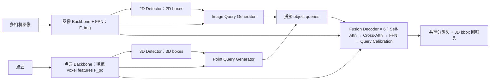

MV2DFusion 不是把图像特征先变换到 BEV 再与 LiDAR 特征相加，也不是先把 2D 框和 3D 框硬匹配。它先利用两个单模态检测器生成输入相关的动态 object queries，再通过 Transformer decoder 进行软关联和信息交换。点云 query 用可靠的单一 3D 中心表示位置；图像 query 则保留多个候选 3D 位置及其概率，融合后逐层校正这个深度分布，最后二者使用同一个 head 解码为确定的 3D bbox。

## 1. 整体流程

两种 query 的核心差异如下：

| 项目              | Point-cloud query            | Image query                           |
| ----------------- | ---------------------------- | ------------------------------------- |
| 上游 proposal     | 3D 检测框                    | 每个相机的 2D 检测框                  |
| 内容              | voxel/BEV/RoI 特征 + 3D 几何 | RoI 外观 + 等效相机内参               |
| 原始位置          | 一个可靠 3D 中心             | \(n_d\) 个候选 3D 位置及概率          |
| 形式              | \(q^{pc}=(c^{pc},r^{pc})\)   | \(q^{img}=(c^{img},s^{img},u^{img})\) |
| Cross-attn anchor | \(a^{pc}=r^{pc}\)            | \(a^{img}=\sum_j u_j^{img}s_j^{img}\) |
| 层间位置更新      | 中心不校准                   | 固定候选点，只校准概率                |
| 默认数量上限      | 200 个                       | 每张图最多 60 个                      |

在 nuScenes 六相机配置下，最多约有 \(200+6\times60=560\) 个当前帧 queries。它们对应“可能存在对象的位置”，而不是铺满整个 BEV 的网格，因此感知范围扩大时，内存不会像稠密 BEV 那样随面积快速增长。

## 2. Point-cloud query 如何生成

### 2.1 点云检测器先产生 3D proposals

点云经过独立 backbone 得到稀疏 voxel features \(F^{pc}\)，再由 LiDAR 3D detector 输出：

\[ b^{pc}\in\mathbb R^{M^{pc}\times7}, \]

其中第 \(i\) 个框为：

\[ b_i^{pc}=(x_i,y_i,z_i,w_i,l_i,h_i,\mathrm{rot}_i). \]

默认 detector 是 FSDv2，最多保留 \(M^{pc}\le 200\) 个检测。MV2DFusion 本身没有规定一个统一的“heatmap 峰值 → Top-K → query”流程；proposal 怎样经过置信度过滤、NMS 或排序，沿用底层 detector 的原始 pipeline。论文只规定最多保留 200 个，不能直接断言为严格 Top-200。

### 2.2 为每个 proposal 取出对应的 appearance feature

每个 3D proposal 都有一个来源特征 \(o_i^{pc}\)。默认 FSDv2 中，它是“产生该预测的稀疏 voxel feature”，并不是把预测框内部的所有点重新做 RoI pooling，也不是在连续中心位置重新插值。

论文给出的兼容关系是：

- center-based detector：采用产生预测的 BEV grid feature；
- two-stage detector：采用对应的 RoI feature；
- 默认 sparse detector：采用产生预测的 voxel feature。

因此 MV2DFusion 要求底层检测器提供的接口本质上是：

\[ \text{3D proposal }b_i^{pc} + \text{产生它的特征 }o_i^{pc}. \]

这也是它能够替换 FSDv2、VoxelNeXt、TransFusion-L 等检测器的原因。

### 2.3 位置部分直接使用 3D 框中心

点云 proposal 已经位于真实尺度的 3D 世界中，所以 query 的 positional part 直接取：

\[ r_i^{pc}=(x_i,y_i,z_i), \qquad r^{pc}\in\mathbb R^{M^{pc}\times3}. \]

最终定义：

\[ q^{pc}=(c^{pc},r^{pc}). \tag{1} \]

这里 \(r^{pc}\) 是显式的 3D reference point，后续同时用于位置编码、图像特征采样 anchor 和最终 bbox 中心回归的基准。

### 2.4 内容部分融合 appearance 与 proposal 几何

Equation (2) 写作：

\[ c^{pc} = \operatorname{MLP} \left( o^{pc} + \operatorname{MLP} \left( \operatorname{SinPos}(b^{pc}) \right) \right). \tag{2} \]

其计算逻辑是：

1. 对低维 bbox 几何参数做 sinusoidal encoding；
2. 内层 MLP 将几何编码映射到与 \(o^{pc}\) 相同的 \(C\) 维；
3. 与来源 voxel/BEV/RoI appearance feature 相加；
4. 外层 MLP 得到最终 query content \(c^{pc}\in\mathbb R^{M^{pc}\times C}\)。

因此 point query 同时保存两类信息：

- \(c^{pc}\)：物体是什么、局部点云长什么样、尺寸和朝向如何；
- \(r^{pc}\)：物体大致位于世界坐标的哪里。

这里存在一个论文内部歧义：Equation (2) 字面上编码完整 \(b^{pc}=(x,y,z,w,l,h,\mathrm{rot})\)，但 Figure 2 将 \((x,y,z)\) 单独送给 \(r^{pc}\)，只把 \((w,l,h,\mathrm{rot})\) 送入 content 的 positional encoding；正文也称该部分表示 size 和 heading。严格来说，论文没有说明实际实现究竟编码 7 维还是仅编码尺寸与朝向，最稳妥的理解是“中心作为显式 position，尺寸和朝向作为主要的 content 几何先验”。

### 2.5 它不是自由学习的 DETR query

普通 DETR 的 query 往往是一组与输入无关的可学习向量；这里的 point queries 是由当前帧真实检测 proposals 动态生成的。其好处是 query 天然落在疑似对象附近，减少大量背景 queries，也使计算量主要随对象数量而不是随 3D 空间体积增长。

## 3. Image query 如何生成

### 3.1 每个 2D 检测框生成一个 query

第 \(v\) 个相机经过 image backbone 和 FPN，得到 \(F_v^{img}\)。2D detector 输出：

\[ b_v^{img}\in\mathbb R^{M_v^{img}\times4}, \qquad b_{v,i}^{img} =(x_{\min},y_{\min},x_{\max},y_{\max}). \]

默认每张图最多保留 60 个框。一个保留的 2D 框只生成一个 image query，而不是每个深度候选生成一个 query。深度候选全部封装在该 query 内部：

\[ q_{v,i}^{img} = \left( c_{v,i}^{img}, s_{v,i}^{img}, u_{v,i}^{img} \right). \]

论文公式没有把 2D 检测类别或置信度直接拼入 query；置信度主要用于上游 proposal 选择。

### 3.2 RoI-Align 提取对象外观

首先从图像特征中截取检测框对应的 RoI：

\[ o_v^{img} = \operatorname{RoIAlign} \left( F_v^{img},b_v^{img} \right), \tag{4} \]

\[o_v^{img} \in \mathbb R^{M_v^{img}\times H^r\times W^r\times C}.\]

RoI feature 经过 Conv 和 Pool，得到对象级外观向量。不过 RoI-Align 将不同位置、不同大小的框全部裁剪成相同尺寸，会丢失框在原图中的绝对位置、尺度以及相机透视关系。

### 3.3 用等效相机内参补回 RoI 几何

原始相机内参写成齐次形式：

\[ K_v^{ori} = \begin{bmatrix} f_x&0&o_x&0\\ 0&f_y&o_y&0\\ 0&0&1&0\\ 0&0&0&1 \end{bmatrix}. \tag{5} \]

对第 \(i\) 个检测框，定义 RoI 缩放比例：

\[ r_x=\frac{W^r}{x_{\max}^i-x_{\min}^i}, \qquad r_y=\frac{H^r}{y_{\max}^i-y_{\min}^i}. \]

等效内参为：

\[ K_v^i = \begin{bmatrix} f_xr_x&0&(o_x-x_{\min}^i)r_x&0\\ 0&f_yr_y&(o_y-y_{\min}^i)r_y&0\\ 0&0&1&0\\ 0&0&0&1 \end{bmatrix}. \tag{6} \]

它描述了“相机坐标 → 当前规范化 RoI 坐标”的投影关系。框的位置通过新的 principal point 编码，框大小通过 \(r_x,r_y\) 和等效焦距编码。这样，即使两个裁剪后的 RoI appearance 很相似，网络仍然能知道它们原本位于图像的哪个方向、占据多大角度范围。

最终 content 为：

\[ c_v^{img} = \operatorname{MLP} \left( \left[ \operatorname{Pool}(\operatorname{Conv}(o_v^{img})); \operatorname{Flat}(K_v) \right] \right). \tag{7} \]

所以 \(c^{img}\) 表示“这个对象看起来是什么，以及它在该相机中的成像几何如何”，但此时还没有确定的 3D 深度。

### 3.4 生成离散深度分布

作者认为单目图像沿视线方向存在严重的深度歧义，因此不直接回归一个确定的 3D 中心。方法先在预定义范围 \([d_{\min},d_{\max}]\) 内均匀采样 \(n_d\) 个深度：

\[ d=(d_1,\ldots,d_{n_d}). \]

然后由 image content 同时预测每个深度对应的二维采样位置和深度 logit：

\[ [s^{2d};u^{logit}] = \operatorname{MLP}(c^{img}), \tag{8} \]\[ u^{img} = \operatorname{softmax}(u^{logit}). \tag{9} \]

张量形状为：

\[ s^{2d}\in \mathbb R^{M^{img}\times n_d\times2}, \qquad u^{img}\in \mathbb R^{M^{img}\times n_d}. \]

这里有一个容易忽视的细节：论文为每个深度 bin 分别预测一对 2D 坐标，而不是只预测一个图像点后沿同一条射线放置全部深度。因此这些候选 3D 点形式上不一定严格共线，只是在 Figure 5 中通常呈现为近似线段。

### 3.5 Camera-to-world projection

每个二维采样位置与对应深度 \(d_j\) 组合，再通过相机内外参反投影到世界坐标，形成：

\[ s^{img} \in \mathbb R^{M^{img}\times n_d\times3}. \]

如果采用常见的“\(d_j\) 是相机 \(z\)-depth、\(s^{2d}\) 是原图像素坐标”约定，反投影可写成：

\[ X_{i,j}^{cam} = d_jK^{-1} \begin{bmatrix} u_{i,j}\\v_{i,j}\\1 \end{bmatrix}, \]\[ s_{i,j}^{img} = R_{cam\rightarrow world}X_{i,j}^{cam} + t_{cam\rightarrow world}. \]

论文只写了 camera-to-world projection，并没有明确说明 \(s^{2d}\) 是原图像素、RoI 局部坐标、归一化坐标还是 box-center offset，也没有给出 \(n_d,d_{\min},d_{\max}\) 的数值。因此上式是标准投影原理的解释，不是论文逐字给出的实现公式。

最终第 \(v\) 个视图的 image queries 为：

\[ q_v^{img} = (c_v^{img},s_v^{img},u_v^{img}), \]

全部相机的 queries 聚合为：

\[ q^{img} = \left\{ q_v^{img} \mid 1\le v\le N^{img} \right\}. \tag{3} \]

多相机中同一物体可能产生多个 image queries，论文没有在进入 decoder 前做显式跨视角合并。

### 3.6 为什么这种表示优于单个 3D 点

假设一个图像目标可能位于 20、30、40 米三个深度，网络无需在生成 query 时就押注其中一个，而可保留：

\[ s^{img}=(s_{20},s_{30},s_{40}), \qquad u^{img}=(0.2,0.5,0.3). \]

后续 point query、点云 pillar 和其他相机提供新的信息后，再将概率重分配到正确深度。它与 LSS 都使用离散深度，但 MV2DFusion 不把图像 feature 复制并 splat 到整个 frustum/BEV，只在单个 query 内保存少量候选位置，因此更加稀疏。

## 4. 两种 query 怎样放进同一个 self-attention

这里要区分三个容易混淆的量：

| 符号                            | 用途                                           |
| ------------------------------- | ---------------------------------------------- |
| \(q=(c,\text{position state})\) | query 保存的完整状态                           |
| \(p\in\mathbb R^C\)             | 加到 Q/K 上的 Transformer 位置编码             |
| \(a\in\mathbb R^3\)             | 采样图像特征和回归 bbox 时使用的确定 3D anchor |

### 4.1 Point query 的位置编码

\[ p^{pc} = \operatorname{PE}(r^{pc}) = \operatorname{MLP} \left( \operatorname{SinPos}(r^{pc}) \right). \tag{10,12} \]

### 4.2 Image query 的 uncertainty-aware PE

图像 query 不能直接用一个中心点编码，因此先编码全部候选位置：

\[ s^{base} = \operatorname{MLP} \left( \operatorname{Flat}(s^{img}) \right), \tag{13} \]

再利用完整概率向量生成 channel-wise gate：

\[ p^{img} = \operatorname{MLP} \left( s^{base} \odot \sigma \left( \operatorname{MLP}(u^{img}) \right) \right). \tag{14} \]

U-PE 并不是简单的位置期望 \(\sum_j u_js_j\)。它编码全部 \(n_d\) 个候选位置，再用整个概率向量进行通道门控。因此两个具有相同期望位置、但一个分布尖锐另一个分布分散的 image query，理论上可以拥有不同的位置编码。

### 4.3 直接拼接，不做 image–point 硬匹配

两种 query 沿数量维拼接：

\[ q^0=(q^{pc},q^{img}), \]

同时定义：

\[ c^{sa}=[c^{pc};c^{img}], \qquad p^{sa}=[p^{pc};p^{img}]. \]

Self-attention 为：

\[ \operatorname{SelfAttn} = \operatorname{MHA} \left( W_Q(c^{sa}+p^{sa}), W_K(c^{sa}+p^{sa}), W_Vc^{sa} \right). \tag{15} \]

因此：

- Q：所有当前 point 和 image queries；
- K：所有当前 point 和 image queries；
- V：所有 query 的 content；
- 位置编码加入 Q/K，影响“应该读取谁”；
- 真正传递的是 V 中的对象语义内容。

这里没有先用 3D IoU、中心距离或 Hungarian algorithm 把某个 image query 与某个 point query 配成一对。空间位置相容、外观语义相似的 queries 会通过注意力权重自动建立软关联。

对同一个汽车，image query 可以从 point query 中读取精确的中心、尺寸与朝向线索；point query 则可以从 image query 中读取纹理和类别语义。对于仅被一个模态检出的目标，该 query 仍然可以独立进入后续解码，不要求两个模态必须同时产生 proposal。

## 5. Cross-attention 如何让 query 回读两种原始特征

Self-attention 是 object-query 之间的信息交换；cross-attention 则让已经融合的 query 回到图像和点云 feature memory 中补充证据。Figure 4 明确表示，两种 query 都会读取两种模态特征，并不是 image query 只看图像、point query 只看点云。

### 5.1 为图像特征采样构造 anchor

Point query 直接使用：

\[ a^{pc}=r^{pc}. \]

Image query 使用概率期望：

\[ a_i^{img} = (u_i^{img})^\top s_i^{img} = \sum_{j=1}^{n_d} u_{i,j}^{img}s_{i,j}^{img}. \tag{17} \]

注意这里的分工：

- Self-attention 使用 \(p^{img}\)，保留完整分布信息；
- Cross-attention 和最终回归使用 \(a^{img}\)，需要一个确定的 3D anchor。

### 5.2 Projection-based deformable attention 读取图像

对任意来源的 query \(m\in\{pc,img\}\)，由其 content 预测若干 3D offsets \(\Delta a_k\) 和注意力权重 \(A_{vk}\)，再把采样点投影到所有相机：

\[ \operatorname{DFA}(c^m,a^m,F^{img}) = \sum_{v=1}^{N^{img}} \sum_{k=1}^{K_s} A_{vk}\, W F_v^{img} \left( \operatorname{Proj}_v(a^m+\Delta a_k) \right). \tag{18} \]

其中 \(K_s\) 是 deformable sampling points 数量，不是相机内参矩阵。对于 point query，这相当于用可靠 LiDAR 中心去图像中读取纹理；对于 image query，则围绕当前深度期望位置重新读取多视图证据。

### 5.3 读取稀疏点云 features

默认 \(F^{pc}\) 是稀疏 voxel features。论文沿高度方向做 pillarization，例如对相同 \(x,y\) 位置的体素平均池化，得到：

- pillar content \(c^{pillar}\)；
- pillar BEV 位置 \(r^{pillar}\)。

其位置编码为：

\[ p^{pillar} = \operatorname{MLP} \left( \operatorname{SinPos}(r^{pillar}) \right). \tag{19} \]

然后 point 和 image queries 都通过普通 MHA 读取这些稀疏 pillar tokens。根据 Figure 4，可等价理解为：

\[ Q=W_Q(c^m+p^m), \quad K=W_K(c^{pillar}+p^{pillar}), \quad V=W_Vc^{pillar}. \]

这条公式是根据 Figure 4 和标准注意力结构展开的合理解释，论文没有单独写出完整代数式。如果使用稠密 BEV 型 LiDAR detector，作者也允许改用 deformable attention 读取点云 feature。

论文没有说明图像 DFA 输出和点云 MHA 输出究竟是相加、串行，还是拼接后投影；只能确定每种 query 都会聚合两个 feature memories，不能进一步虚构内部合并算子。

## 6. Query calibration 如何利用 LiDAR 校正图像深度

每层 decoder 的主顺序为：

\[ \text{Self-Attention} \rightarrow \text{Cross-Attention} \rightarrow \text{FFN} \rightarrow \text{Query Calibration}. \]

经过前三部分后，image content \(c^{img}\) 已包含 point queries、点云 pillars、多视角图像和其他 image queries 的信息。此时只更新深度概率，不移动候选位置：

\[ u^{logit} = \log(u^{img}), \tag{20} \]\[ u^{img} \leftarrow \operatorname{softmax} \left( u^{logit} + \operatorname{MLP}(c^{img}) \right). \tag{21} \]

令 \(\Delta=\operatorname{MLP}(c^{img})\)，该更新等价于：

\[ u_j^{new} = \frac{ u_j^{old}\exp(\Delta_j) }{ \sum_k u_k^{old}\exp(\Delta_k) }. \]

可以将它理解成“旧深度分布 × 当前多模态证据”，但论文没有把它定义为严格的贝叶斯推断。若 LiDAR query 表明目标位于 30 米，融合后的 \(c^{img}\) 会提高对应深度 bin 的 \(\Delta_j\)，将概率从错误深度转移过去。

每次校准后都重新计算：

\[ p^{img,l} = \operatorname{U\!-\!PE} (s^{img},u^{img,l}), \]\[ a^{img,l} = (u^{img,l})^\top s^{img}. \]

于是下一层会同时获得：

- 更准确的 self-attention 位置编码；
- 更准确的图像 deformable-attention 采样 anchor；
- 更准确的最终 bbox 回归 anchor。

候选位置 \(s^{img}\) 始终不动，只重新分配概率。这种设计稳定且便宜，但如果真实深度完全落在初始候选集合之外，后续校准不能创造新的候选位置。Point query 不做这种 calibration，因为作者认为其 3D 中心更可靠，但最终 regression head 仍可对中心回归残差，所以 point bbox 并未被锁死。

默认 decoder 共 6 层。Figure 6 显示随着层数增加，image-query anchor 与匹配 GT 的位置 MSE 持续下降，验证了逐层校准确实在改善定位。

## 7. 如何解码最终 3D bbox

第 \(L\) 层得到融合后的 query contents \(c^L\) 和最终 anchors \(a^L\)。两种来源的 query 使用完全相同的共享 head。

分类输出为：

\[ z^{cls} = \operatorname{MLP}_{cls}(c^L). \tag{22} \]

回归目标为：

\[ (x,y,z,w,l,h,\mathrm{rot},v_x,v_y), \]

速度在需要时使用。回归为：

\[ z^{reg} = \operatorname{MLP}_{reg}(c^L) + [a^L;0]. \tag{23} \]

展开理解为：

\[ \begin{aligned} x &= a_x^L+\Delta x,\\ y &= a_y^L+\Delta y,\\ z &= a_z^L+\Delta z,\\ (w,l,h,\mathrm{rot},v_x,v_y) &= \operatorname{MLP}_{reg}(c^L)_{\text{remaining}}. \end{aligned} \]

其中：

- point query 使用 \(a^L=r^{pc}\)，在 LiDAR proposal 中心附近精修；
- image query 使用 \(a^L=\sum_j u_j^{img,L}s_j^{img}\)，即校准后深度分布的期望；
- 尺寸、朝向和速度没有对应 anchor，\([a^L;0]\) 中剩余维度补零；
- 最终每个 query 都输出一个类别分数和一个确定的 3D box candidate。

因此，image query 的概率分布不会直接成为最终输出。它的作用是为多层融合保留不确定性；到了最终回归阶段，分布通过期望变成一个 anchor，再加上网络预测的中心残差，产生单一 3D bbox。

论文没有说明尺寸是否取 log、yaw 是否使用 \((\sin\theta,\cos\theta)\)、坐标是否归一化，也没有说明最终是否额外执行 3D NMS，所以这些不能从 Equation (23) 擅自补全。

## 8. 重复 queries 如何处理，以及损失如何训练

两类 query 不做预先配对，但 decoder 的最终预测使用 DETR 风格 Hungarian 一对一匹配。匹配的是“所有融合后 query predictions 与 GT”，不是 image query 与 point query 之间的匹配。

分类采用 focal loss，框回归采用 L1：

\[ \mathcal L_{out} = \lambda_{cls}\mathcal L_{cls} + \mathcal L_{reg}. \tag{26} \]

一对一监督会让同一物体对应的多个 image/point queries 发生竞争：其中一个 query 与 GT 匹配，其他重复 queries 被训练为较低置信度。这可以间接抑制跨相机和跨模态重复，但论文没有给出专门的跨视角去重公式。

两个上游 detector 保留各自原始损失：

\[ \mathcal L_{det2D}, \qquad \mathcal L_{det3D}. \]

Image query generator 还有深度辅助监督。首先把 GT 3D box 投影到第 \(v\) 个相机，得到 \(\hat b_v^{proj}\)，与预测 2D boxes 计算：

\[ U_{ij} = \operatorname{IoU} (b_{v,i}^{img},\hat b_{v,j}^{proj}). \]

只有当 \(U_{ij}\) 同时是第 \(i\) 行最大值、第 \(j\) 列最大值，且 \(U_{ij}>\tau_{IoU}\) 时才匹配。随后用 GT depth 对 image query 的离散深度分布做交叉熵监督：

\[ \mathcal L_{aux} = \operatorname{CE} (d_{v,i}^{img},\hat d_{v,j}^{proj}). \tag{27} \]

Equation (27) 将网络输出记成 \(d^{img}\)，但前文实际预测概率记为 \(u^{img}\)；结合 CE 和上下文，它应当表示深度 logits/离散分布，这是论文的记号不一致。

总损失为：

\[ \mathcal L = \lambda_{det2D}\mathcal L_{det2D} + \lambda_{det3D}\mathcal L_{det3D} + \lambda_{aux}\mathcal L_{aux} + \lambda_{out}\mathcal L_{out}. \tag{28} \]

检测器会先预训练，也可以联合训练；nuScenes 默认实验中作者冻结了 point-cloud detector，以避免过拟合。

## 9. 用一个汽车例子串起完整过程

1. LiDAR detector 在 \((31.0,4.2,0.8)\) 米附近检测到汽车，用产生该检测的 sparse voxel feature 和框尺寸、朝向构造 point query。
2. 前视相机产生一个汽车 2D 框，RoI appearance 与等效内参形成 \(c^{img}\)，再生成多个可能深度的 3D 候选点，例如主要分布在 25–40 米。
3. Self-attention 发现该 image query 与 LiDAR query 在位置编码和语义上相容，于是图像 query 吸收 LiDAR 的准确定位，LiDAR query 吸收图像的类别和纹理信息。
4. 两个 query 又分别读取多视角图像和稀疏 point-cloud pillars；融合后的 image content 将深度概率逐渐集中到约 31 米。
5. 最后一层以 point center 或 image distribution expectation 为 anchor，回归中心残差、尺寸、朝向和速度；Hungarian matching 决定哪个 query 负责输出该汽车，其他重复 queries 被压低分数。

如果这辆汽车距离很远、LiDAR 没有产生 proposal，image query 仍可独立完成预测；如果图像因遮挡而深度模糊，point query 则提供可靠 3D anchor。这正是两种 modality-specific query 同时存在的意义。

## 10. 论文实验怎样支持这些设计

| 设置                        | NDS/CDS   | mAP   | 说明                   |
| --------------------------- | --------- | ----- | ---------------------- |
| 仅 point queries            | 0.737     | 0.716 | 缺少图像补充           |
| 仅 image point-form queries | 0.733     | 0.707 | 缺少 LiDAR 精确几何    |
| 两类 query，图像使用单点    | 0.743     | 0.725 | 已有 query-level 融合  |
| 两类 query，图像使用分布    | 0.747     | 0.728 | nuScenes 最佳设置      |
| AV2 图像单点                | 0.373 CDS | 0.464 | 长距离深度误差明显     |
| AV2 图像分布                | 0.395 CDS | 0.486 | 分布式表示优势扩大     |
| 移除 feature cross-attn     | 0.740     | 0.715 | self-attn 本身已能融合 |
| 完整 cross-attn             | 0.747     | 0.728 | 回读原始特征继续提升   |

这说明最核心的跨模态融合已经发生在 query self-attention 中；feature cross-attention 进一步补充细粒度证据。分布式 image query 在 AV2 长距离场景中的提升更明显，也符合单目深度随距离增大而更不可靠的设计动机。

一句话总结：**MV2DFusion 先让 LiDAR 用“一个可靠 3D 点”表达位置，让图像用“一组带概率的 3D 候选点”表达位置；再通过 query self-attention 建立软跨模态关联，通过 feature cross-attention读取两个模态的原始证据，并利用融合后的内容逐层重标定图像深度概率；最后以 LiDAR 中心或图像概率期望作为 anchor，由共享 head 回归统一的 3D bbox。**

